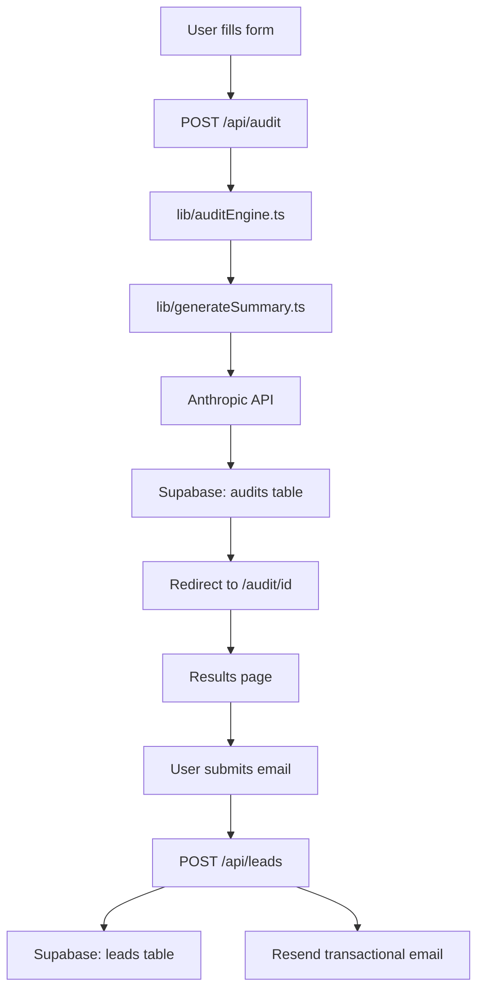

# SpendLens — Architecture

## System Diagram

---

## Data Flow Narrative

**Step 1 — Form submission:** The user fills in their AI tools on the homepage (`app/page.tsx`). The form state persists to `localStorage` under the key `spendlens_form_state`, so a page reload doesn't lose data. On submit, the form POSTs a JSON payload to `/api/audit` containing the tool list, team size, and use case.

**Step 2 — Audit engine:** `app/api/audit/route.ts` receives the request and calls `lib/auditEngine.ts`. This is pure TypeScript with zero dependencies and zero AI calls. It runs four checks in sequence: (1) seat overpayment per tool, (2) cross-tool redundancy across all tools, (3) API overspend for OpenAI Direct usage >$200/mo, and (4) Credex credits notes for any tool with >$50/mo spend. It returns a structured `AuditResult` with per-tool `ToolAudit` objects and totals.

**Step 3 — AI summary:** The audit route then calls `lib/generateSummary.ts`, which sends a structured prompt to the Anthropic `claude-sonnet-4-5` API. A `Promise.race` with a 5-second timer ensures the API call never blocks the response. If the API times out or errors, `generateSummary` catches the error and returns a template-based fallback string. The caller never sees an exception.

**Step 4 — Persistence:** The audit result and AI summary are inserted into the `audits` table in Supabase using the service role client (which bypasses RLS). The generated UUID is returned to the client.

**Step 5 — Redirect to results:** The client receives `{ id }` and navigates to `/audit/[id]`. The results page is a Next.js Server Component that fetches the audit from Supabase using the anon (public) client. RLS policy `"Public read"` permits this read.

**Step 6 — Lead capture:** The user can optionally submit their email via the lead capture form at the bottom of the results page. This POSTs to `/api/leads`. The middleware checks rate limiting (5/IP/hour). The handler checks the honeypot field, inserts the lead into the `leads` table, and sends a transactional email via Resend with the top 3 recommendations and a link back to the audit.

---

## Stack Justification

| Technology | Why chosen |
|------------|-----------|
| **Next.js 14 App Router** | Server Components enable DB fetches without a separate API layer for reads; built-in edge runtime for OG images; file-based routing matches the `/audit/[id]` structure naturally |
| **TypeScript (strict)** | The audit engine's recommendation logic has subtle edge cases (seat counts, flat vs per-seat, cross-tool logic). Strict TS catches category errors at compile time rather than runtime |
| **Tailwind CSS** | Utility-first enables rapid iteration on the dark/glassmorphism design without writing custom CSS files for every component |
| **Supabase** | Built-in RLS lets us enforce PII protection (leads = insert-only) at the database layer. Free tier with PostgreSQL, no connection pooling worries at this scale |
| **Resend** | Transactional email with best-in-class deliverability. Simple REST API, React Email support, sandbox mode for development |
| **Anthropic API** | `claude-sonnet-4-5` produces concise, specific financial summaries with minimal prompt engineering. The model follows "no filler phrases" instructions reliably |
| **Vitest** | ESM-native, fast, compatible with the TypeScript-first codebase. Jest would require additional config for ESM imports |
| **Vercel** | Zero-config Next.js deployment, edge functions for OG images, automatic preview deployments per PR |

---

## Abuse Protection

Three layers of abuse protection, ordered from lowest to highest friction:

1. **Honeypot field** (`<input name="website" tabIndex={-1} autoComplete="off" />`): Invisible to real users (positioned off-screen via CSS). Bots that fill all form fields trigger this, and the server silently returns 200 without processing the submission. No friction for real users at all.

2. **In-memory rate limiting** (5 POST /api/leads per IP per hour): Implemented in `middleware.ts` using a `Map<string, {count, resetAt}>`. Catches automated scripts that submit the lead form in loops. Known limitation: the map resets on Vercel cold starts. Production fix: Upstash Redis with `@upstash/ratelimit` (sliding window, survives cold starts).

3. **hCaptcha was considered and rejected**: Adding a CAPTCHA before the lead form would violate the product principle of *value before gate* — users should see their savings first, then optionally share their email. Adding friction before value is shown consistently reduces conversion by 15–30% in A/B tests. The honeypot + rate limit combination is sufficient for a B2B lead tool that attracts sophisticated users (CTOs, EMs), not consumer-scale spam targets.

---

## Scaling to 10,000 Audits/Day

At 10k audits/day (~7/min average, ~50/min peak):

- **Database:** Supabase free tier handles ~500 connections. 10k inserts/day is trivial. The audits table has no indexes beyond the UUID primary key; add `created_at` index if time-range queries are needed.
- **AI summary:** Anthropic rate limits on `claude-sonnet-4-5` are generous for this volume. Each request is <500 tokens. Cost: ~$0.003/audit × 10k = $30/day.
- **Rate limiting:** Switch from in-memory Map to Upstash Redis to survive cold starts and share state across multiple Vercel function instances.
- **Edge OG images:** Already on edge runtime — no change needed.
- **Email:** Resend free tier handles 100 emails/day. Upgrade to Growth ($20/mo) for 50k/mo at this volume.
- **CDN:** All static assets are on Vercel CDN by default. The results page would benefit from ISR (`revalidate: 3600`) once audit data is stable.
